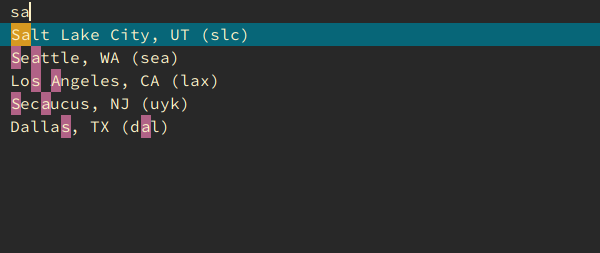

# mullvad-dmenu
A simple script to use with Mullvad VPN cli and Dmenu to connect to a country
and city of choice.

**Disclaimer:** This software is not in any way endorsed by, or connected to 
Mullvad VPN AB.
